---
# --- Metadatos Básicos ---
title: "Análisis Estadístico de la Correlación entre Hábitos Auditivos y Perfiles de Salud Mental"
author:
   - Nicole Melissa Altera Pino
   - María Emilia Arteaga Fernández
   - Daniela Alexandra Daza Tovar
date: "Abril 2026"

# --- Metadatos Específicos de Plantilla ---
degree: "Computación I"
director: 
  - Jesus Ochoa 
  - Oliver Triveño
lugar: "Caracas"
facultad: 
  - Facultad de Ciencias Económicas y Sociales
  - Escuela de Estadistica y Ciencias Actuariales
# Ruta al escudo (relativa al archivo .Rmd)
escudo: "Latex/Classes/Escudos/faces"

# --- Bibliografía ---
bibliography: bibliografia.bib

# --- Configuración de Salida ---
output: 
  pdf_document:
    template: template.tex  # Llamamos al archivo de plantilla
    keep_tex: true                 # Útil para ver errores si ocurren
    toc: true                      # Generar índice
    number_sections: true
    citation_package: natbib       # Importante: forzar natbib porque tu plantilla lo usa

# --- Resumen (Abstract) ---
abstract: |
  En el presente informe se realiza un análisis descriptivo sobre la relación entre los hábitos de consumo musical y ciertos indicadores de salud mental. Se estudian variables como: el género musical favorito, las horas de escucha al día, y el impacto de la música en el bienestar emocional; aplicando técnicas de estadística descriptiva y visualización de datos avanzada mediante R y Python.
---

```{r setup, include=FALSE}
# Configuración global de chunks
knitr::opts_chunk$set(
  echo = FALSE,        # Mostrar código
  warning = FALSE,    # Ocultar advertencias
  message = FALSE,    # Ocultar mensajes de carga
  fig.align = "center",
  out.width = "90%",
  fig.pos = "H",
  out.extra = ""
)
```


```{r, include=FALSE}
# Cargar librerías necesarias
library(tidyverse)
library(knitr)
library(kableExtra)
library(scales)
library(janitor)

#Base de datos
datos_musica <- read_csv("1. Musica.csv")

#Renombrar columnas 
datos_musica <- datos_musica |> clean_names()

#Limpieza de base de datos
View(datos_musica)

#Eliminación de columnas innecesarias para el análisis
datos_musica <- datos_musica |> select(-timestamp, -permissions)

#Verificación de datos faltantes
summary(datos_musica)

#Estructura de los datos 
glimpse(datos_musica)

#Eliminación de NA y su sustitución con la mediana
datos_musica <- datos_musica |>
  mutate(age = if_else(is.na(age), median(age, na.rm = TRUE), age),
         bpm = if_else(is.na(bpm), median(bpm, na.rm = TRUE), bpm))
colSums(is.na(datos_musica))

##Verificación de espacios vacíos
datos_musica |>
  summarise(across(where(is.character), ~sum(. == "" | is.na(.), na.rm = TRUE)))

#Ver cuales variables se repiten en las variables cualitativas y sustituir por la moda
# Ver la moda de cada columna
datos_musica |> tabyl(music_effects) |> arrange(desc(n))
datos_musica |> tabyl(foreign_languages) |> arrange(desc(n))
datos_musica |> tabyl(instrumentalist) |> arrange(desc(n))
datos_musica |> tabyl(while_working) |> arrange(desc(n))
datos_musica |> tabyl(primary_streaming_service) |> arrange(desc(n))
datos_musica |> tabyl(composer) |> arrange(desc(n))

datos_musica <- datos_musica |>
  mutate(music_effects = if_else(music_effects == "" | is.na(music_effects), "Improve",
        music_effects)) |>
  mutate(foreign_languages = if_else(foreign_languages == "" | is.na(foreign_languages), "Yes",
        foreign_languages)) |>
  mutate(instrumentalist = if_else(instrumentalist == "" | is.na(instrumentalist), "No", 
        instrumentalist)) |>
  mutate(while_working = if_else(while_working == "" | is.na(while_working), "Yes", 
        while_working)) |>
  mutate(primary_streaming_service = if_else(primary_streaming_service == "" | 
        is.na(primary_streaming_service), "Spotify", primary_streaming_service)) |>
  mutate(composer = if_else(composer == "" | is.na(composer), "No", composer))

#Revisión de las edades
summary(datos_musica$age)

#Definimos que cualquier bpm mayor a 500 es un error y lo pasamos a la mediana 
summary(datos_musica$bpm)

#Usamos 500 porque es el límite aproximado de géneros súper rápidos como el Speedcore
datos_musica <- datos_musica |> 
  mutate(bpm = if_else(bpm > 500 | bpm < 40, median(bpm, na.rm = TRUE), bpm))
summary(datos_musica$bpm)

#Verificando el resumen de escucha por día
summary(datos_musica$hours_per_day)

#Reemplazar valores fuera de rango (0-24) con NA
datos_musica <- datos_musica |> 
  mutate(hours_per_day = ifelse(hours_per_day > 24 | hours_per_day < 0, NA, 
  hours_per_day))

#Calculamos la mediana
mediana_hours <- median(datos_musica$hours_per_day, na.rm = TRUE)

#Rellenamos con la mediana en los huecos
datos_musica <- datos_musica |> 
  mutate(hours_per_day = ifelse(is.na(hours_per_day), mediana_hours, hours_per_day))

#Verificando el rango de las escalas, que el mínimo sea 0 y el máximo 10
datos_musica |> 
  select(anxiety, depression, insomnia, ocd) |> summary()

# Vemos la estructura y el tipo de datos antes del cambio
datos_musica |> 
select(starts_with("frequency_")) |> 
glimpse()

#Verificando si las columnas de frequency tienen espacios vacíos
datos_musica |> 
  summarise(across(starts_with("frequency_"), ~sum(is.na(.) | . == "" | . == " ")))

#Identificar las columnas y le asignamos su nuevo valor 
datos_musica <- datos_musica |> 
  mutate(across(starts_with("frequency_"), 
                ~ case_match(.,
                             "Never" ~ 1,
                             "Rarely" ~ 2,
                             "Sometimes" ~ 3,
                             "Very frequently" ~ 4,
                             .default = NA_real_)))
#Verificamos el cambio
datos_musica |> 
  select(starts_with("frequency_")) %>% 
  glimpse()

# Vemos la estructura y el tipo de dato
str(datos_musica[c("while_working", "exploratory", "instrumentalist", "composer")])

#Identificamos las columnas que tienen "Yes"/"No"
columnas_si_no <- c("while_working", "instrumentalist", "composer", 
                    "exploratory", "foreign_languages")

# Convertimos Yes a 1 y No a 0
datos_musica <- datos_musica |> 
  mutate(across(c(while_working, instrumentalist, composer, 
                  exploratory, foreign_languages),
                ~ case_when(
                  . == "Yes" ~ 1,
                  . == "No" ~ 0,
                  TRUE ~ NA_real_
                )))

#Verificamos el cambio
str(datos_musica[c("while_working", "exploratory", "instrumentalist", "composer")])

# Vemos la estructura y el tipo de dato antes del cambio
table(datos_musica$music_effects)

#Identificar las columnas y le asignamos su nuevo valor 
datos_musica <- datos_musica |> 
  mutate(music_effects = case_match(music_effects,
                                    "Worsen" ~ -1,
                                    "No effect" ~ 0,
                                    "Improve" ~ 1,
                                    .default = NA_real_))
#Verificamos el cambio
table(datos_musica$music_effects)

#Definimos los indicadores
indicadores <- c("anxiety", "depression", "insomnia", "ocd")

#Hacemos la suma por fila
datos_musica$total_salud <- rowSums(datos_musica[, indicadores], na.rm = TRUE)

#Ahora creamos el rango 
datos_musica$rango_salud <- cut(datos_musica$total_salud, 
                                breaks = c(-Inf, 13, 26, 40), 
                                labels = c(1, 0, -1))

#Lo convertimos a número
datos_musica$rango_salud <- as.numeric(as.character(datos_musica$rango_salud))

#Verificamos el cambio
table(datos_musica$rango_salud)
summary(datos_musica$total_salud)

#Guardamos los datos limpios
write_csv(datos_musica, "datos_musica_limpios_FINAL.csv")
dfclean <- read_csv("datos_musica_limpios_FINAL.csv")
view(dfclean)

```
\chapter*{Introducción}

\begin{flushright}
\textit{“La música no es, como todas las otras artes, una representación de las ideas o grados de la objetivación de la voluntad, sino la expresión directa de la voluntad misma; lo cual explica su acción inmediata sobre la voluntad, es decir, sobre los sentimientos, las pasiones y las emociones del oyente, de modo que rápidamente los exalta o los modifica”} \\
\medskip
Schopenhauer, 2005, pág. 177
\end{flushright}

   La música es una manifestación cultural inherente a la condición humana, presente en todas las civilizaciones y épocas históricas. Además de su valor recreativo, diversos estudios contemporáneos han demostrado que la música posee una capacidad única para influir en la química del cerebro. Según Daniel Levitin (neurocientífico y músico): “la música actúa sobre los sistemas neuroquímicos que regulan el estrés y el placer, afectando así directamente en las emociones y el comportamiento humano”.
Al interactuar con el sistema límbico, la música no solo genera placer, sino que actúa como un regulador del estado de ánimo, capaz de modular la liberación de neurotransmisores claves. De igual forma, se ha documentado que ciertas frecuencias y ritmos musicales, facilitan la reducción de los niveles de cortisol, la principal hormona esteroide del estrés, impactando positivamente en el manejo del mismo y la ansiedad clínica.

Bajo estos precedentes, el presente trabajo se propone describir cuantitativamente la intersección entre la experiencia musical y la salud mental de los participantes. El objetivo central es investigar, mediante técnicas de estadística descriptiva, cómo variables específicas, tales como: el género musical favorito, las pulsaciones por minuto (BPM) y los hábitos de consumo (tiempo de exposición), influyen en indicadores de salud mental, como: la ansiedad, la depresión, y el insomnio, en la muestra estudiada.

\chapter{Planteamiento del Problema}

   Según la Organización Mundial de la Salud (OMS), “La salud mental es un estado de bienestar mental que permite a las personas hacer frente a los momentos de estrés de la vida, desarrollar todo su potencial, aprender y trabajar adecuadamente y contribuir a su comunidad”. Sin embargo, durante los últimos años, diversos estudios han reportado un incremento significativo en los trastornos relacionados con la salud mental, como trastornos de ansiedad, del estado de ánimo, de la personalidad, entre otros; especialmente entre adolescentes y adultos jóvenes. Este incremento se debe a factores como: la pandemia de COVID-19, el aislamiento social y las presiones económicas, según la Organización Panamericana de Salud (OPS). En este contexto, se ha incrementado el interés por analizar los factores cotidianos que pueden influir en la salud mental. Uno de los más relevantes es el consumo de música, actividad que forma parte de la vida diaria de millones de personas, y que puede cumplir diferentes funciones emocionales, cognitivas y sociales. Con este proyecto, se busca establecer relaciones acerca de cómo, la forma en que los hábitos de escucha musical (el tiempo dedicado a escuchar música, los géneros preferidos o la frecuencia de consumo), pueden relacionarse con indicadores de salud mental, como la ansiedad, la depresión, el insomnio o los comportamientos compulsivos; esto mediante la realización de un análisis estadístico de la evaluación entre los hábitos de consumo musical y variables asociadas a la salud mental.\

Debido a esto, se plantea las siguientes preguntas de investigación:\

\textbf{1.}¿Existe una asociación estadísticamente significativa entre el tempo del género musical preferido por los participantes y su nivel de salud mental?\

\textbf{2.}¿Cómo se distribuye la percepción del efecto de la música sobre el estado emocional en función de si los participantes escuchan música mientras trabajan?\

\textbf{3.}¿Qué relación existe entre la diversidad de géneros musicales escuchados por los participantes y sus niveles de bienestar emocional?\

\section{Justificación}

El estudio de la relación entre la música y la salud mental ha adquirido una creciente relevancia en diversas disciplinas, especialmente en la psicología y la sociología. La música constituye una de las formas de expresión cultural más universales y accesibles, y su consumo forma parte de la rutina diaria de una gran parte de la población.
Asimismo, debido a su capacidad para influir en las emociones, el estado de ánimo y los procesos cognitivos, la música ha sido considerada en múltiples investigaciones como un factor asociado al bienestar psicológico.
Desde una perspectiva académica y científica, resulta significativo analizar esta relación mediante el uso de herramientas de análisis estadístico y modelado de datos que permitan identificar patrones, tendencias y correlaciones entre variables asociadas con los hábitos musicales y distintos indicadores de salud mental. Este tipo de análisis puede contribuir a ampliar el conocimiento sobre la influencia del consumo musical en el bienestar emocional, así como a generar conclusiones a raíz de los resultados obtenidos sobre la relación entre estas variables dentro de una población determinada.\

\section{Objetivos}
\subsection{Objetivo General}
\begin{itemize}
\item{Describir y analizar la evaluación entre los hábitos de consumo musical y diferentes indicadores de salud mental mediante el uso de técnicas de análisis estadístico.}
\end{itemize}

\subsection{Objetivos Específicos}
\begin{itemize}
  \item{Describir la estructura y características del conjunto de datos relacionados con hábitos musicales y variables de salud mental.}
  \item{Describir la distribución de los indicadores de salud mental mediante medidas de tendencia central y dispersión para identificar el perfil general de salud mental de los participantes.}
  \item{Comparar la distribución de los indicadores de salud mental, utilizando herramientas gráficas como diagramas de caja.}
  \item{Evaluar la asociación entre el ritmo musical (BPM) y el nivel general de afección mental declarado, para evaluar la existencia de una relación entre ritmos acelerados y complicaciones de salud mental.}
  \item{Describir la relación entre el uso de la música en el trabajo y la percepción de su impacto (Mejora, Empeora, Nulo) en el bienestar de los participantes.}
  \item{Comparar la distribución de edades de la muestra con los niveles de salud mental reportados.}
  \item{Explorar la asociación entre la diversidad de géneros musicales escuchados y los niveles de bienestar emocional mediante herramientas de estadística descriptiva.}
\end{itemize}

\section{Periodo de Referencia}
La población objeto de estudio está conformada por individuos que participaron en una encuesta relacionada con hábitos musicales y salud mental. Dicha encuesta estuvo disponible entre el 27 de julio de 2022 y el 8 de noviembre del mismo año, a nivel mundial. La muestra utilizada corresponde a, aproximadamente, 700 registros (736 observaciones), los cuales contienen información sobre: variables demográficas, hábitos de consumo musical y condiciones relacionadas con la salud mental de los encuestados.\

\section{Variables}
La variable principal en estudio (Variable Dependiente/Objetivo) es el Nivel de Salud Mental, que representa el estado de bienestar psicológico del individuo. Esta se mide a través de una escala cuantitativa de 0 a 10, donde 0 indica ausencia total de síntomas y 10 representa la severidad máxima.Se consideran las siguientes variables:\

\textbf{1.}Variables Psicológicas: Ansiedad y Depresión, evaluadas como indicadores del estado emocional predominante.\

\textbf{2.}Variable Fisiológica: Insomnio, la cual mide la calidad e higiene del sueño y su impacto en el descanso.\

\textbf{3.}Variable Conductual: OCD (Trastorno Obsesivo-Compulsivo), utilizada como indicador de comportamientos compulsivos asociados a niveles de estrés.\

Como variables explicativas o independientes se analizan:\
\begin{table}[ht]
\centering
\renewcommand{\arraystretch}{1.5}
\resizebox{\textwidth}{!}{%
\begin{tabular}{ccc}
  \hline
TIPO & VARIABLE & DESCRIPCIÓN \\
  \hline
Cuantitativa & BPM & Velocidad o pulsaciones por minuto del género preferido. \\
Cualitativa & While working & Si el participante escucha música mientras trabaja o estudia. \\
Cualitativa & Music effects & Opinión sobre si la música mejora o empeora el estado emocional.\\
Cuantitativa & Age & Edad cronológica del participante. \\
Cualitativa & Primary streaming service & Plataforma utilizada para escuchar música. \\
Cuantitativa & Hours per day & Tiempo diario dedicado a la escucha de música. \\
Cualitativa & Instrumentalist & Indica si el participante toca algún instrumento musical. \\
Cualitativa & Composer & Indica si el participante compone música propia. \\
Cualitativa & Fav genre & Género musical preferido del usuario. \\
Cualitativa & Exploratory & Indica si busca activamente nuevos géneros. \\
Cualitativa & Foreign languages & Escucha de música en idiomas no nativos. \\
Cualitativa & Frequency & Nivel de recurrencia de escucha por género. \\
Cuantitativa & Salud total & Puntaje sumatorio de indicadores de salud mental. \\
Cualitativa & Rango salud & Clasificación del estado de salud según puntaje. \\

   \hline
\end{tabular}
}
\caption{Variables consideradas}
\end{table}

\chapter{Marco Teórico}

\section{Bases Teóricas}

Existen múltiples investigaciones científicas que describen cómo la música ayuda a mejorar la salud mental de las personas. En el área de psicología, existen diversos autores que teorizan sobre cómo el cerebro se ve afectado positiva o negativamente según el estilo y las características de la música que se escucha. 
Para el presente trabajo, se ha tomado como referencia principal las investigaciones de Daniel Levitin, neurocientífico y músico. Su trabajo analiza cómo los elementos técnicos, como el ritmo y el tempo, activan sistemas de recompensas en el cerebro, lo que brinda una idea sobre el impacto de los mismos en la salud mental y cómo esto puede verse reflejado en la población de investigación. Este mismo autor señala en su libro: “Tu cerebro y la música. El estudio científico de una obsesión humana", que la música es un estímulo multisensorial complejo, profundamente arraigado en la arquitectura de nuestro cerebro, con la capacidad de provocar respuestas fisiológicas, psicológicas y emocionales profundas.\ 

Existe una relación entre las diferentes zonas cerebrales y las características psicológicas de la música y la audición: la actividad sensorial de la música estaría localizada predominantemente en la zona bulbar, donde se encuentra el centro de las reacciones físicas. El mensaje afectivo de la música lo localizamos en el diencéfalo, zona profunda del cerebro, asiento de las emociones. La melodía afecta a la vida emocional y afectiva y es el diencéfalo el que recibe los motivos y diseños melódicos, despertando así todo un mundo interior de sentimientos y emociones.\

\subsection{Conceptos de Salud Mental} 
\begin{itemize}
 \item{Salud mental: es el estado de bienestar en el que el individuo es consciente de sus capacidades, afronta las tensiones normales de la vida, trabaja de forma productiva y contribuye a su comunidad (OMS, 2013).}
 \item{Higiene mental: la higiene mental se refiere a las prácticas y hábitos que ayudan a mantener un equilibrio emocional y una salud mental positiva.} 
 \item{Catarsis emocional: es la descarga de emociones intensas, reprimidas o negativas (como ira, tristeza o miedo), que provoca una sensación de alivio, purificación o claridad interior.}
 \item{Sistema nervioso simpático (SNS): es una red de nervios que ayuda al cuerpo a activar su respuesta de "lucha o huida". La actividad de este sistema aumenta cuando se está estresado, en peligro o durante la actividad física.}
 \item{Cortisol: es una hormona producida por las glándulas suprarrenales, afecta a casi todos los órganos del cuerpo y es importante para las funciones corporales, como manejar el estrés y mantener la presión arterial. Niveles muy altos o bajos de esta hormona tienen un impacto negativo en la salud mental, causando ansiedad, depresión, problemas de memoria, irritabilidad y fatiga.}
 \item{Adrenalina: es una hormona y un neurotransmisor que segrega el cuerpo de manera natural a través de las glándulas suprarrenales. El organismo produce y almacena esta sustancia y la libera en situaciones de alarma, estrés, miedo, peligro o excitación.}
 \item{Comorbilidad:coexistencia de dos o más enfermedades o trastornos en un mismo individuo, generalmente relacionadas.}

\subsection{Indicadores de Salud Mental}
 \item{Ansiedad (Anxiety): los trastornos de ansiedad se pueden definir como la experimentación de miedo y preocupaciones intensas y excesivas. Estos sentimientos suelen ir acompañados de tensión física y otros síntomas conductuales y cognitivos. (OMS, 2013).}
 \item{Depresión (Depression): se puede describir como el hecho de sentirse triste, melancólico, infeliz, abatido o derrumbado. La depresión clínica es un trastorno del estado anímico en el cual los sentimientos de tristeza, pérdida, ira o frustración interfieren con la vida diaria. (OMS, 2013).}
 \item{Insomnio (Insomnia): es la dificultad para iniciar o mantener el sueño debido a una incapacidad del cerebro para transitar de las ondas beta (alerta) a las ondas alfa y theta (relajación). (OMS, 2013).}
 \item{Trastorno Obsesivo-Compulsivo (OCD - Obsessive Compulsive Disorder): es un trastorno mental en el cual las personas tienen pensamientos, sentimientos, ideas, sensaciones (obsesiones) y comportamientos repetitivos e indeseables que los impulsan a hacer algo una y otra vez (compulsiones). (OMS, 2013).}
\end{itemize}
En psicología y ciencias de la salud, estos trastornos no suelen presentarse de forma aislada; por el contrario, comparten una varianza común que puede ser interpretada como un factor de Malestar Psicológico General. Por ende, la suma de los indicadores de ansiedad, depresión, insomnio y trastorno obsesivo-compulsivo se justifica bajo la premisa de la cormobilidad; y dicha suma se denominaría “Índice de Carga Sintomática Acumulada (ICSA)”.
Al utilizar una escala homogénea (del 0 a 10) en todas las variables, se garantiza la comparabilidad métrica. Matemáticamente, este procedimiento se define como un Índice Aditivo No Ponderado, donde cada dimensión aporta de igual manera a la carga total del individuo. 
Si el ICSA mide la severidad de un individuo, la media de todos los participantes representa la Intensidad de Afectación de la muestra.\

\subsection{Conceptos Musicales}
\begin{itemize}
 \item{Música: es una sucesión de señales acústicas que el oído humano recoge y envía al cerebro. Allí, se decodifican y se les da un significado. El cerebro involucra a las emociones, que son las encargadas de convertir el sonido en algo comprensible. (UNIR, 2026).}
 \item{Tempo: es la velocidad o ritmo al que se interpreta una pieza musical, determinando qué tan rápido o lento es el pulso. Se mide en bpm (beats per minute o pulsaciones por minuto), indicando cuántos pulsos ocurren en un minuto: a mayor número de bpm, más rápida es la música.}
 \item{BPM (beats per minute): es la unidad de medida objetiva. 60 bpm equivalen a un pulso por segundo, 120 bpm significan dos pulsos por segundo, y así sucesivamente.Algunas marcas de tempo comunes incluyen:
- Grave (20-40 bpm): extremadamente lento,
- Largo (45-50 bpm): ampliamente lento,
- Adagio (55-65 bpm): lento,
- Andante (70-110 bpm): a ritmo de paseo,
- Allegro (110-130 bpm): rápido, veloz y brillante,
- Vivace (130-140 bpm): animado y rápido,
- Presto (170 - 200bpm): extremadamente rápido.
}
\end{itemize}

\subsection{Hábitos de consumo musical}

Escucha diaria de música: se define como el tiempo de exposición sonora diaria. Según organizaciones médicas, existe un punto de saturación auditiva o fatiga sensorial. Si bien la música moderada reduce el cortisol, la exposición excesiva (muchas horas a volúmenes altos o con BPM frenéticos) puede provocar fatiga cognitiva, donde el cerebro deja de procesar la música como un estímulo placentero y la comienza a percibir como ruido de fondo estresante.\

\subsection{Estadística descriptiva}
Para el procesamiento de los datos, se emplearon diversas medidas descriptivas que permiten caracterizar el comportamiento de la muestra en estudio.\

**Medidas de tendencia central:** indicadores que permiten resumir un conjunto de datos (en este caso, la muestra en estudio), en un solo valor representativo.\

**Media aritmética:** representa el promedio aritmético de los puntajes y/o valores del dataset. Es sensible a datos atípicos.\

$$\bar{x} = \frac{1}{n} \sum_{i=1}^{n} x_i$$
**Mediana:** es el valor central de la distribución (es decir, el que deja un 50% de los datos por arriba, y el otro 50% por debajo) cuando los datos se encuentran ordenados.\

$$\tilde{x} = P_{50}$$
**Moda:** es el valor que ocurre con mayor frecuencia.\
$$M_o = \text{Valor con mayor frecuencia } (f_i)$$
**Medidas de dispersión y variabilidad:** indican qué tan dispersos están los datos con respecto a una medida de tendencia central; en este caso, la media aritmética.\
**Varianza:** promedio de los cuadrados de las desviaciones respecto a la media.\

$$s^2 = \frac{\sum_{i=1}^{n} (x_i - \bar{x})^2}{n - 1}$$
**Desviación estándar:** raíz cuadrada de la varianza.\
$$s = \sqrt{\frac{\sum_{i=1}^{n} (x_i - \bar{x})^2}{n - 1}}$$
**Medidas de posición (cuartiles):** dividen la muestra en cuatro partes iguales para identificar la distribución.\
**Primer cuartil (Q1):** el valor por debajo del cual se encuentra el 25% de la muestra.\
$$Q_1 = \text{Valor en la posición } \frac{n+1}{4}$$
**Tercer cuartil (Q3):** el valor que supera al 75% de los datos.\
$$Q_3 = \text{Valor en la posición } \frac{3(n+1)}{4}$$
**Rango intercuartílico (RIC):** es la diferencia entre Q3 y Q1. Representa la dispersión del 50% central de los datos.\
$$RIC = Q_3 - Q_1$$
**Coeficiente de correlación de Pearson:** se utiliza para medir la fuerza y dirección de la relación lineal entre dos variables cuantitativas.\
$$r = \frac{\sum (x_i - \bar{x})(y_i - \bar{y})}{\sqrt{\sum (x_i - \bar{x})^2 \sum (y_i - \bar{y})^2}}$$
\chapter{Marco Metódico}

\section{Bases metódicas utilizadas en el trabajo de investigación}

El presente estudio es una investigación de tipo cuantitativa, ya que se basa en el análisis de datos mayormente tratados de manera numérica, relacionados con los hábitos de consumo musical y variables de salud mental. A su vez, tiene un carácter descriptivo y correlacional, ya que busca describir, tanto las características de los datos, como la posible relación entre las variables estudiadas.
Dicho estudio tiene un enfoque empírico y analítico, ya que se fundamenta en el análisis de datos reales obtenidos a partir de una encuesta. Se emplean métodos estadísticos para identificar patrones, tendencias, asociaciones entre las variables y estimar un posible motivo para dichas asociaciones.
Por otro lado, el diseño de la investigación es no experimental, transversal. Esto debido a que los datos fueron recolectados en un único momento en el tiempo y no se manipularon las variables, sino que se analizaron tal como se presentan en el conjunto de datos.\

\subsection{Procesamiento de datos y herramientas utilizadas}

Las herramientas utilizadas para el procesamiento de los datos fueron, principalmente, los lenguajes de programación Python y R, en conjunto con ciertas librerías que facilitaron y permitieron la lectura, visualización, y manipulación óptima de los datos. Asimismo, se emplearon entornos de desarrollo como Visual Studio Code y RStudio, la plataforma GitHub para la gestión del estudio y, por último, R Markdown para la realización del informe académico.\

\subsection{Limpieza, transformación, y lectura de datos}
Para realizar la preparación del dataset, en primer lugar, se importaron las librerías necesarias. Tras la lectura de los datos, se procedió a remover las columnas innecesarias para el análisis posterior; en este caso, se removieron las columnas “Timestamp” (luego de verificar que no existieran registros duplicados) y “Permissions”. Posteriormente, se calculó la cantidad de registros nulos y/o inválidos dentro del dataset, para comprobar que no existiera una cantidad significativa de estos que pudiera distorsionar los futuros resultados.\

Una vez hecho esto, se procedió a establecer rangos lógicos para cada columna de las variables cuantitativas se estableció un rango de 0 a 110 para la edad de los participantes, de 0 a 24 para las horas de escucha al día, y de 40 a 500 para los valores de BPM; catalogando a los datos que no se encontraran en estos rangos como nulos, para después sustituir los registros vacíos y/o ilógicos con la mediana de cada columna, debido a la robustez de la misma. Esto con la finalidad de no alterar los posteriores cálculos de medidas estadísticas sensibles, como lo es la media aritmética.\

Luego, se procedió a la asignación de valores numéricos a las columnas de variables cualitativas ordinales; las cuales, en este caso, fueron las referentes a la frecuencia con la que los encuestados escuchan ciertos géneros musicales. Esto con la finalidad de facilitar posteriores cálculos e interpretaciones. Estas columnas, particularmente, no presentaron valores nulos o atípicos, pues posiblemente fueron planteadas en la encuesta a modo de selección simple.\

Posteriormente, se realizó la asignación de valores numéricos a las columnas de variables cualitativas dicotómicas; que, en este caso, se trataron como datos booleanos, y los registros nulos fueron reemplazados por la respectiva moda. Lo mismo se realizó para la columna “Music effects”, la cual es una variable politómica de 3 categorías (“Improve”, “No Effect”, y “Worsen”), así que simplemente se le asignaron los valores 1 a la categoría “Improve”, 0 a “No Effect”, y -1 a “Worsen”.\

Para finalizar, se evaluaron las columnas cualitativas nominales, de las cuales solo la columna “Primary streaming service” presentaba nulos, y fueron sustituidos por la moda. Asimismo, las columnas de las variables referentes a indicadores de salud mental, tampoco presentaron valores nulos y/o atípicos.\

Por último, se añadieron dos columnas adicionales: “Total_Salud” y “Rango_Salud”. La primera de estas fue generada al realizar la sumatoria de los cuatro indicadores de salud mental para cada individuo o fila. Cada variable de salud mental se encuentra en un rango del 0 a 10, por lo tanto, la sumatoria de los cuatro se encontrará en un rango entre 0 y 40 puntos; donde, mientras más puntos acumulados tenga el participante, peor se considera el estado de salud mental general del mismo.\

La segunda columna adicional refleja, según el valor resultante de la sumatoria, en qué categoría se encuentra el participante: Buena, Regular, o Alarmante. Esto con la finalidad de transformar el puntaje en categorías interpretables posteriormente. Esta división se realizó según los siguientes rangos:\

\begin{itemize}
\item{Rango 0-13 (Categoría: “Buena” / Código: 1): este rango representa a los participantes con una estabilidad emocional óptima, ya que, en la suma de los indicadores de las variables, indicaron un puntaje bajo, lo que refleja ausencia o niveles mínimos de síntomas asociados a una desfavorable salud mental.}
\item{Rango 14-26 (Categoría: “Regular” / Código: 0): el valor 0 se asocia a un estado de vulnerabilidad intermedio. Se define como “regular” ya que hay una presencia moderada de los indicadores evaluados.}
\item{Rango 27-40 (Categoría: “Alarmante” / Código: -1): representa el nivel más crítico de salud mental. Durante la suma de las variables, el participante puntuó alto en las dimensiones evaluadas, lo que representa un nivel de higiene mental poco saludable.}
\end{itemize}

Transformar cuatro variables en una sola variable escalar permite simplificar el análisis sin perder la riqueza de los datos originales.
El propósito de sumar los indicadores es permitir la estratificación de la muestra. Al establecer puntos de corte (0-13, 14-26, 27-40), el estudio puede catalogar a los participantes en grupos de salud mental (Buena, Regular, Alarmante), lo que resulta más cómodo para la obtención de conclusiones que el análisis de síntomas por separado.\

\subsection{Técnicas de análisis de datos}
\begin{itemize}
\item{Análisis de tendencia central: para variables cuantitativas, se hizo uso de indicadores como la Media Aritmética y la Mediana, con el fin de encontrar el valor típico y más representativo de cada indicador, y así, poder establecer comparaciones.}
\item{Análisis de Dispersión: se hizo uso de la Varianza, el Cuartil 1 y el Cuartil 3, con el fin de describir la dispersión de los datos para las variables cuantitativas.}
\item{Análisis de Asociación: se empleó el Coeficiente de Correlación de Pearson para calcular la covarianza entre variables numéricas, como BPM y las variables de salud mental. También se hizo uso de Tablas de Contingencia, para describir la influencia de la música mientras se trabaja.}
\end{itemize}

\subsection{Desarrollo del Dashboard Interactivo}
Para complementar el análisis estadístico y facilitar la interpretación de los resultados, se desarrolló un Dashboard interactivo utilizando el framework de Streamlit, integrando en el mismo las librerías necesarias para la visualización e interactividad de los datos. El objetivo principal del Dashboard es permitir una exploración dinámica de los datos, visualizando de forma clara y accesible las relaciones entre los hábitos de consumo musical y los indicadores de salud mental. Esta herramienta se estructuró con cuatro pestañas, cada una diseñada para responder a cada uno de los objetivos específicos del trabajo.\

\begin{itemize}
\item{Inicio: a través de métricas calculadas, se muestra la cantidad de participantes en estudio, el porcentaje de participantes que reportan una mejoría en su bienestar emocional al escuchar música, y el promedio de la puntuación acumulada de los indicadores de salud mental por cada individuo. Como añadidura, se creó un generador de datos curiosos con la librería “Random” de Python. Esta sección está construida con componentes de CSS, para obtener una visión personalizada y atractiva de la misma pestaña.}
\item{Salud Mental: se hizo uso de Plotly Express para generar diagramas de caja (Boxplots) que permiten identificar la mediana y la variabilidad de las cuatro patologías analizadas (Ansiedad, Depresión, Insomnio y TOC).}
\item{Hábitos Musicales: se analizaron las variables de consumo musical, examinando la relación entre el ritmo promedio (BPM) y el estado general de salud mental, así como el efecto percibido de la música durante la actividad laboral. También, mediante el uso de diagramas de violín, se evaluó el impacto de las horas diarias de escucha sobre la calidad del sueño, específicamente respecto a los niveles de insomnio.}
\item{Análisis Avanzado: se implementó un mapa de calor (Heatmap) con escalas de color personalizadas, para identificar la fuerza de asociación entre variables como la edad, las horas de escucha y los niveles de salud mental (Correlación de Pearson). De igual manera, se añadió un gráfico de embudo dinámico para representar la relación entre el rango de edad y el puntaje acumulado de salud mental. Por último, se integraron diagramas de caja para realizar una comparativa técnica de los indicadores de Ansiedad y Depresión, segmentados por género musical favorito.}
\end{itemize}

Asimismo, se implementaron filtros y visualizaciones interactivas mediante la librería Plotly, permitiendo a los usuarios ajustar los parámetros de análisis dinámicamente. El desarrollo del código se centralizó en un repositorio de GitHub bajo un sistema de control de versiones, lo que optimizó la colaboración técnica. Finalmente, la aplicación fue desplegada en la plataforma Render, asegurando la disponibilidad pública y permanente de los resultados a través de una dirección URL única.\

\chapter{Análisis de Resultados}
\section{Distribución de Indicadores de Salud Mental}
Para los primeros hallazgos, referentes a la distribución de las variables de salud mental, se hizo uso de histogramas de frecuencias con curvas de densidad, las cuales permiten estimar la forma de las distribuciones. Asimismo, se incorporaron medidas tanto de tendencia central como de dispersión, con el fin de comprender a mayor profundidad la tendencia de los datos.\

```{r, echo=FALSE,fig.cap="Gráfico Anxiety 4.1.1" ,out.width="100%", fig.align='center'}
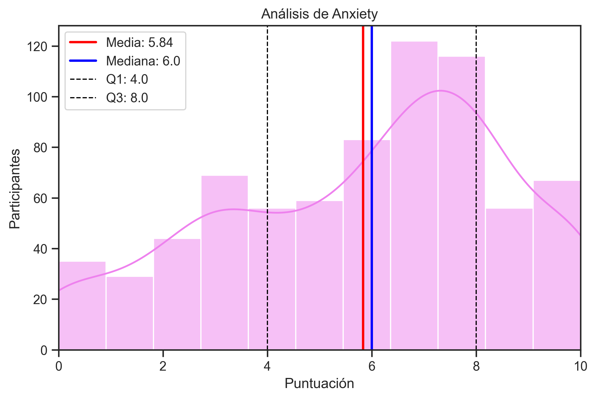
```

El primer gráfico, para la variable Ansiedad, refleja una tendencia hacia valores moderadamente altos, evidenciada por una mediana de 6 y una media aritmética de 5.84. La proximidad entre estas medidas sugiere una distribución con un ligero sesgo negativo, mientras que, el análisis de la variabilidad a través del RIC, muestra que el 50% central de la muestra se sitúa entre una puntuación de 4.0 y 8.0, siendo este un rango moderadamente alto. Existe una clara división en la muestra entre participantes con niveles moderados-bajos (pico en 3) y un grupo más numeroso con niveles severos (pico en 7.5), dejando el valor central (5) como el punto menos frecuente.\

```{r, echo=FALSE,fig.cap="Gráfico Depression 4.1.2" ,out.width="100%", fig.align='center'}
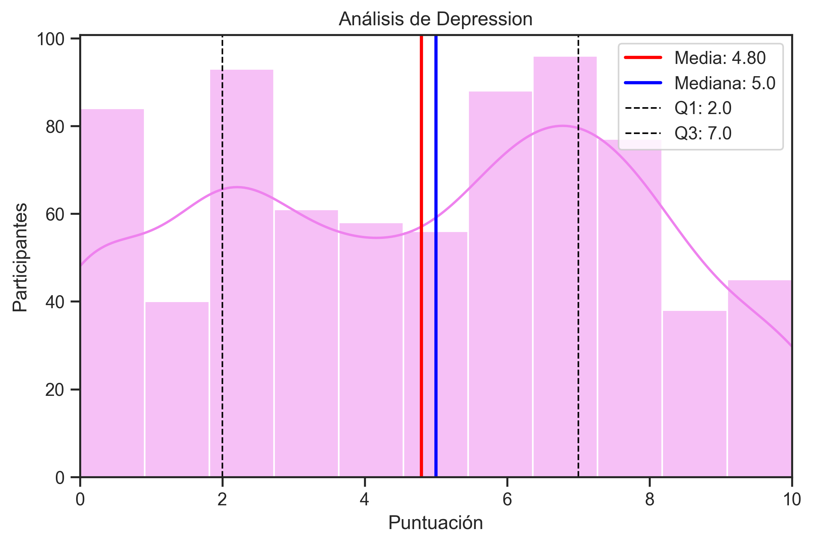
```

Se observa una tendencia predominante hacia niveles moderados-altos, alcanzando su frecuencia máxima en el 7. A diferencia de otras variables, la depresión muestra una presencia constante en todos los niveles de la escala, aunque con una clara concentración en el segmento superior (6-8). Este comportamiento sugiere que, si bien hay un grupo significativo con bienestar emocional, la mayoría de los participantes reporta indicadores de depresión por encima del punto medio de la escala.\

```{r, echo=FALSE,fig.cap="Gráfico Insomnia 4.1.3" ,out.width="100%", fig.align='center'}
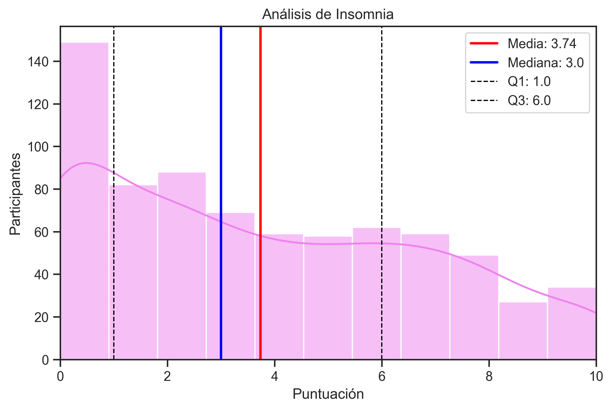
```
Este gráfico muestra picos de frecuencia destacados en los extremos inferiores y en el punto 5, lo que sugiere una población con hábitos de sueño muy polarizados: mientras un grupo importante reporta una ausencia casi total de insomnio, existe una proporción considerable de la muestra que experimenta dificultades de sueño en niveles medios.\

```{r, echo=FALSE, fig.cap="Gráfico OCD 4.1.4" ,out.width="100%", fig.align='center'}
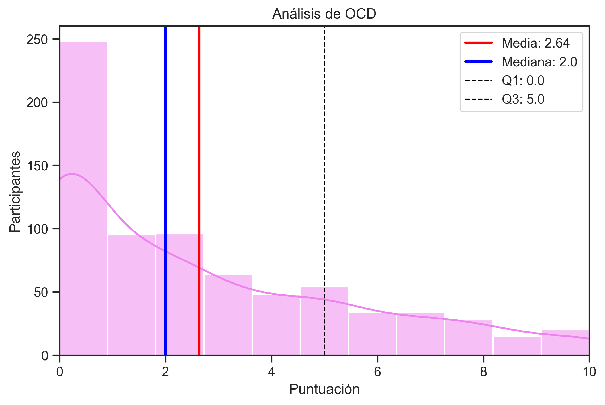
```

Para la variable TOC, se evidencia una distribución con una tendencia central baja. Visualmente se destacan picos de frecuencia en los valores más bajos de la escala, lo que sugiere que la gran mayoría de la muestra reporta síntomas de TOC mínimos o nulos.


\section{Comparación de la Distribución (Diagramas de caja)}

Se refleja que la Ansiedad es, por mucho, el síntoma más severo en la muestra, y sus valores se desplazan hacia los valores altos de la muestra. En contraste, el TOC (OCD) muestra la mediana más baja y una caja notablemente más comprimida hacia el origen, indicando una mayor homogeneidad en los reportes de síntomas mínimos para esta categoría. Por su parte, la Depresión y el Insomnio exhiben una dispersión relativamente similar.\

```{r, echo=FALSE, fig.cap="Box Plots de Salud Mental 4.2" ,out.width="100%", fig.align='center'}
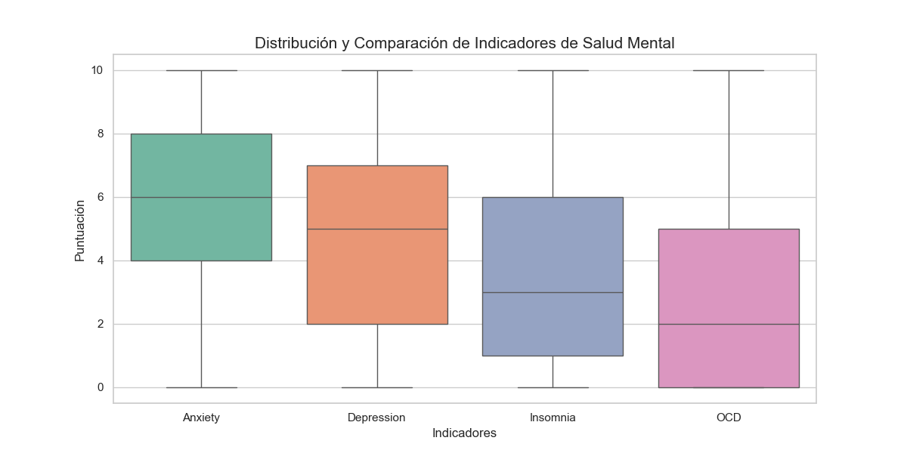
```

\section{Indicadores de Salud Mental por Género Favorito}

Se comparó el género favorito de los participantes con sus indicadores tanto de Ansiedad, como de Depresión, ya que son las variables en las que los valores reportados fueron más altos.\

Con respecto a la ansiedad, se observó que, lo oyentes de Latin, reportan los niveles de ansiedad más bajos de la muestra. Por el contrario, géneros como el Folk y el Rock muestran una tendencia central desplazada hacia niveles superiores (7-8), con una dispersión menor en el caso del Folk, lo que sugiere un perfil de usuario más homogéneo en cuanto a su estado emocional. Los puntos observados en Pop y Folk representan casos atípicos de bienestar emocional (nivel 0) dentro de grupos que, por lo general, reportan puntuaciones moderadas-altas.\

Con respecto a la depresión, se evidencian contrastes marcados: mientras que el Gospel y la música Latina presentan las medianas más bajas, sugiriendo una asociación con menores indicadores de depresión, géneros como el Hip hop y el Lofi muestran una tendencia central significativamente más alta. Es notable la homogeneidad en los niveles altos reportados por los oyentes de Lofi, en contraste con la alta dispersión observada en géneros como el Country, donde no se aprecia un patrón definido.\

```{r, echo=FALSE, fig.cap="Box Plots por Género favorito (Anxiety) 4.3.1" ,out.width="100%", fig.align='center'}
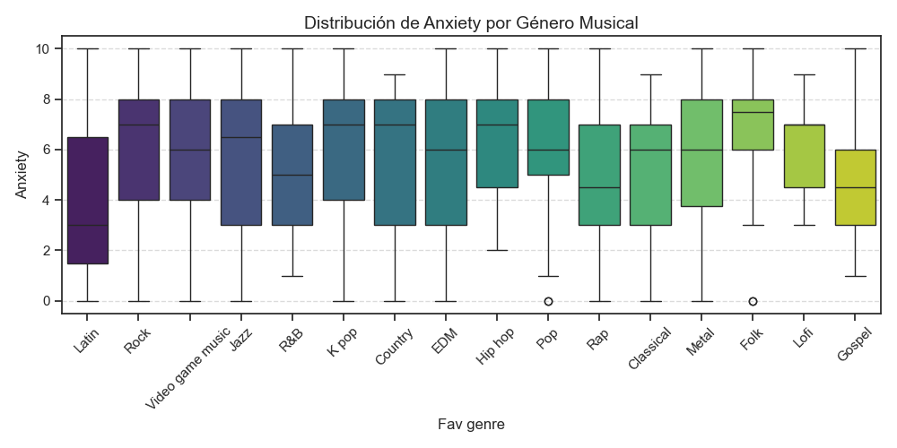
```

```{r, echo=FALSE, fig.cap="Box Plots por Género favorito (Depression) 4.3.2" ,out.width="100%", fig.align='center'}
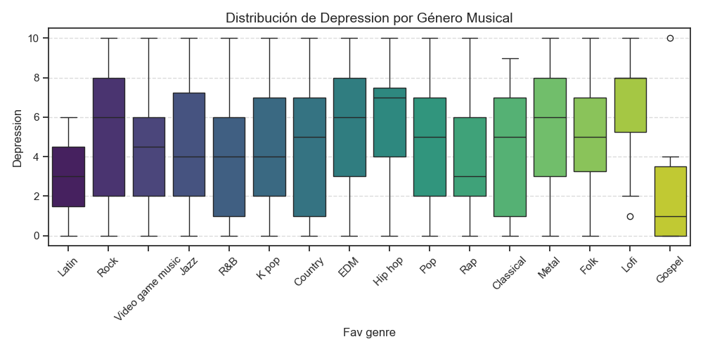
```


\section{Relación entre BPM y el rango de Salud Mental}

Existe una correlación directa, aunque muy débil, entre el malestar psicológico y el aumento de las pulsaciones por minuto. A medida que el estado de salud mental empeora (de "Buena" a "Alarmante"), el BPM promedio sube.\

```{r, echo=FALSE, fig.cap="Gráfico Embudo 4.4" ,out.width="100%", fig.align='center'}
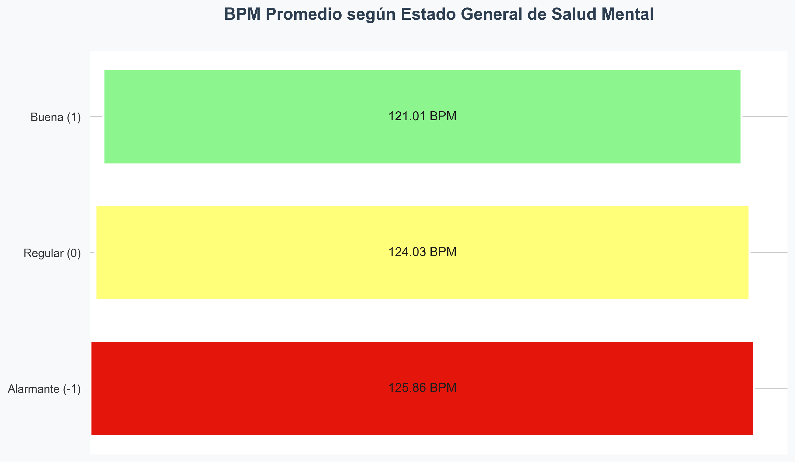
```


\section{Impacto de la Música al Trabajar}
Se evidencia que la música se percibe mayoritariamente como un potenciador del trabajo, y que el rechazo hacia ella (efecto negativo) es extremadamente bajo en la muestra estudiada. Incluso entre quienes afirman no trabajar habitualmente con música, hay un grupo considerable que opina que esta mejora su desempeño, superando a los que creen que no tiene efecto alguno o les empeora.\

```{r, echo=FALSE, fig.cap="Gráfico Impacto de la música al trabajar 4.5" ,out.width="100%", fig.align='center'}
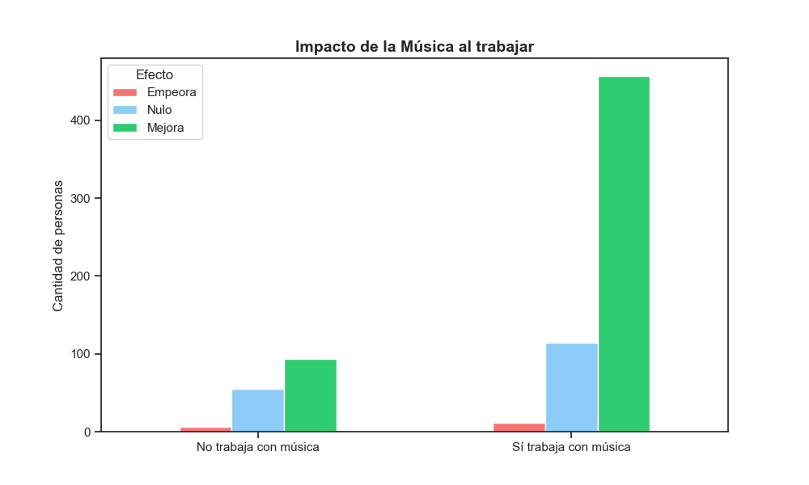
```

\section{Correlación de Variables Numéricas}

En este gráfico, 1 representa correlación positiva, 0 ausencia de correlación, y -1 correlación negativa. Se evidencia que hay una fuerte correlación de 0.52 entre las variables Ansiedad y Depresión; es decir, que quienes reportan altos niveles de Ansiedad, también tienden a reportar altos niveles de Depresión. Asimismo, la ansiedad tiene una relación moderada con los síntomas de trastorno obsesivo-compulsivo, y hay una relación clara entre el estado de ánimo depresivo y los problemas de sueño. \
Por otro lado, la variable edad presenta una correlación negativa leve con casi todos los indicadores de salud, sugiriendo que, en esta muestra específica, los participantes más jóvenes tienden a reportar niveles ligeramente más altos de ansiedad y otros trastornos que los participantes de mayor edad.\
Con respecto a la variable BPM, en estos datos, no posee algún tipo de relación significativa con los niveles de salud mental. Por último, la variable 'Hours per day' revela que el tiempo de consumo musical es relativamente independiente del estado de salud mental del usuario, con solo una leve asociación positiva hacia el insomnio.\

```{r, echo=FALSE, fig.cap="Gráfico Mapa de calor 4.6" ,out.width="100%", fig.align='center'}
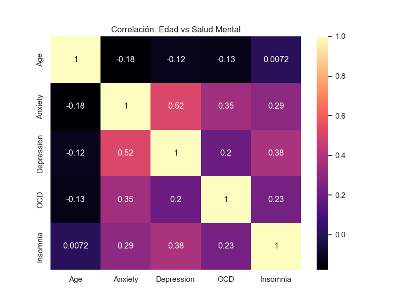
```

\section{Estadísticas Descriptivas (Top 5 Géneros Más Escuchados)}

Para esta tabla se tomaron en cuenta la Mediana y el RIC, ya que se está trabajando con variables ordinales, y el espacio entre cada valor no necesariamente es el mismo, por lo que las medidas de posición son más óptimas.\ 

Por la parte de Ansiedad, El Rock destaca con la mediana más alta, de 7. Esto indica que, al menos el 50% de sus oyentes, reportan niveles de ansiedad de 7 o más, superando al resto de los géneros. En cuanto al género Pop, su RIC es el más bajo pese a tener una mediana de 6, indicando que las respuestas de sus oyentes tienden a ser similares entre sí. 
Por otro lado, Video game music es el género con la mediana más baja en la categoría Depresión, lo que indica que sus oyentes tienden a reportar estados de ánimo ligeramente más positivos o neutrales.\

Con respecto al Insomnio, el Metal tiene la mediana más alta y uno de los RIC más altos. Esto indica que que los oyentes de este género están muy divididos: un grupo posee insomnio severo y otro duerme perfectamente.
Por último, TOC es el indicador con los valores más bajos en todos los géneros, reflejando así que los síntomas obsesivo-compulsivos son poco comunes dentro de la muestra, independientemente de la preferencia en el género musical.\

```{r, echo=FALSE, fig.cap="Tabla 5 Géneros Más Escuchados 4.7" ,out.width="100%", fig.align='center'}
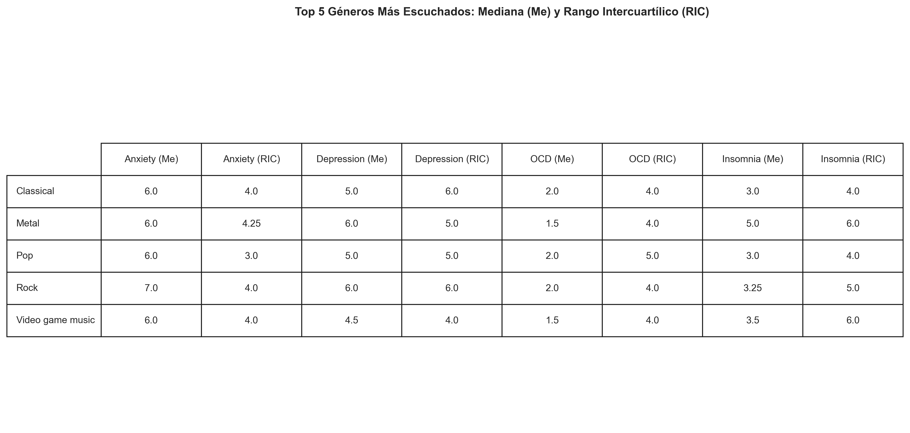
```

\chapter{Conclusiones y Recomendaciones}

\textbf{1.-}  Los valores de salud mental referidos, especialmente para las variables Ansiedad e Insomnio, son preocupantes, ya que la tendencia es hacia valores medios-altos a pesar de que la muestra fue completamente aleatoria; es decir, no se centró en individuos con antecedentes patológicos conocidos, lo que sugiere una prevalencia significativa en la población general estudiada. Esto puede deberse al hecho de que la encuesta fue realizada durante una época en la que, la salud mental de la población a nivel mundial, se vio fuertemente afectada debido al aislamiento social, la crisis económica, y las pérdidas que generó la Pandemia (COVID-19); pues esta aumentó en un 25% la prevalencia de la ansiedad y la depresión en todo el mundo, afectando desproporcionalmente a adultos jóvenes y adolescentes, según la Organización Mundial de la Salud (OMS).\

\textbf{2.-}  El Rock y el Metal presentan los indicadores más críticos: el Rock, con una mediana de 7 en ansiedad, y el Metal con la mayor prevalencia de insomnio, pero con una variabilidad bastante alta. Esto puede asociarse con que, la música con un Tempo elevado, puede generar un fenómeno llamado entrenamiento rítmico, estimulando el sistema nervioso simpático, aumentando la liberación de cortisol y adrenalina. La mediana de ansiedad en el Rock sugiere que, este estado de alerta constante, inducido por ritmos enérgicos, podría estar generando una sensación de tensión en los oyentes frecuentes. Por otro lado, la variabilidad alta del Insomnio indica que el Metal actúa de forma distinta según el individuo: mientras que para algunos el BPM alto resulta en catarsis, para otros funciona como un estresor que fragmenta el ciclo del sueño.\
A pesar de esto, se debe tener en cuenta que la música funciona a menudo como un mecanismo de afrontamiento; por ende, es posible que las personas ya ansiosas busquen ritmos rápidos para externalizar su energía, creando una relación donde el género musical no es necesariamente la causa, sino el refugio del estado mental.\

\textbf{3.-}El gráfico 4.4 refleja que los estados "Alarmantes" coinciden con BPMs promedio más altos. Sin embargo, el mapa de calor (Gráfico 4.6) muestra una correlación de apenas 0.05 entre BPM y ansiedad/depresión. Teniendo esto en cuenta, se concluye que no es solo la velocidad del Tempo lo que altera la salud mental, sino también factores como la exposición prolongada y la sensibilidad individual.\

Por otro lado, se muestra una correlación negativa entre las variables Edad y Ansiedad. Es decir: a medida que aumenta la edad de los participantes, disminuye la intensidad de la ansiedad reportada. Esto podría indicar que los jóvenes, en el intervalo de tiempo donde fue tomada la muestra, fueron el grupo más vulnerable al estrés del entorno global, mostrando consistencia con las tendencias globales reportadas por la OMS en 2022.\

\textbf{Recomendación} Ampliación de la muestra: se sugiere para futuras investigaciones incrementar el tamaño de la población y su muestra, con la finalidad de mejorar la representatividad de los resultados y reducir el margen de error. Una muestra más robusta permitirá realizar inferencias más concretas y sólidas sobre la población del estudio.\

\textbf{Recomendación} 
Mejora en los instrumentos de evaluación: debido a que los niveles de salud mental fueron evaluados mediante encuestas digitales (Google Forms), los datos están sujetos a la percepción subjetiva y a sesgos del entrevistado. Para minimizar el sesgo, se recomienda que en futuros estudios se incorporen evaluaciones hechas por profesionales del área de la salud mental, para de esta manera garantizar una medición objetiva y clínica de las variables.\

\textbf{Recomendación} 
Mediciones corporales: se recomienda para futuras investigaciones se incorporen mediciones biométricas como la variabilidad de la frecuencia cardíaca o niveles de cortisol al escuchar géneros específicos, para correlacionar la percepción subjetiva con respuestas fisiológicas objetivas.\

\textbf{Recomendación} 
Prevención de la fatiga auditiva: se recomienda el uso de la música dentro de los decibeles recomendados por la OMS (generalmente por debajo de los 80 dB para exposiciones prolongadas). El uso de volúmenes excesivos no solo anula los efectos relajantes de la música, sino que puede inducir estados de estrés fisiológico, irritabilidad y daños irreversibles en el sistema auditivo.\

\appendix
\renewcommand{\thechapter}{\Alph{chapter}}

\chapter{Anexo A}

```{r, echo=FALSE, fig.cap="Gráfico de violín Insomnio según horas de música al dia" ,out.width="100%", fig.align='center'}
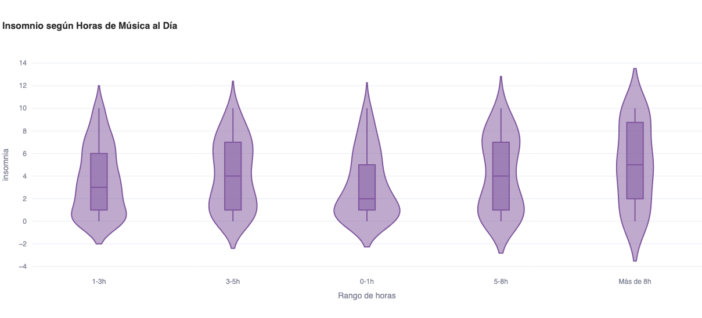
```
Crecimiento: Se observa una tendencia levemente ascendente: a mayor número de horas de música, la mediana del índice ICSA tiende a subir.\

Outliers: El grupo de 0-2 horas presenta un valor atípico muy alto, lo que indica que existen casos aislados con alta carga sintomática a pesar del bajo consumo.\

Cuartiles: El desplazamiento hacia arriba de las cajas en los grupos de 8-12 horas sugiere una mayor prevalencia de síntomas en consumidores intensivos.\


\chapter{Anexo B}

```{r, echo=FALSE, fig.cap="ICSA según horas de música al día" ,out.width="100%", fig.align='center'}
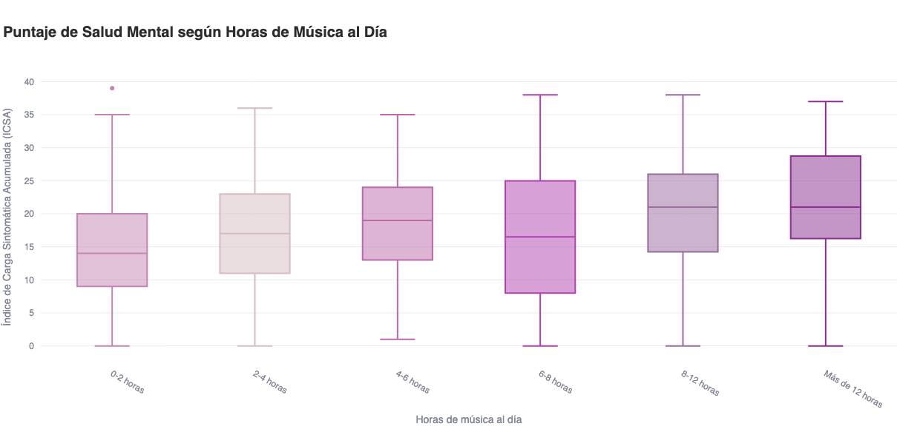
```

Densidad: El ancho del "violín" representa dónde se concentra la mayoría de las personas. Un violín más ancho en la parte superior indica que en ese grupo el insomnio es más frecuente.\

Tendencia: Observamos que quienes escuchan más de 8 horas de música tienden a mostrar una mayor dispersión y medianas ligeramente más altas de insomnio.\


\chapter{Referencias bibliográficas}

\begin{itemize}
\item{Healthdirect. (s.f.).“The role of cortisol in the body”.}

\item{Morales, M. L. (1990).“Psicometría aplicada”. Editorial Trillas.}

\item{Organización Mundial de la Salud. (17 de noviembre de 2021).“Salud mental del adolescente”.}

\item{Organización Mundial de la Salud. (2 de marzo de 2022). “La pandemia de COVID-19 provoca un aumento del 25% en la prevalencia de la ansiedad y la depresión en todo el mundo”.}

\item{Tomatis, Afred (1969):“El oído y el lenguaje”. Barcelona. Ed. Martínez Roca.}

\item{Willems, E. (1956):“Las bases psicológicas de la educación musical”. Buenos Aires. Eudeba.}

\item{Despins, Jean Paul (1989):“La música y el cerebro”. Barcelona. Ed.Gedisa.}

\item{Levitin, D. J. (2006).Tu cerebro y la música: El estudio científico de una obsesión humana. RBA Libros.}

\item{Organización Mundial de la Salud. (2013).Plan de acción sobre salud mental 2013-2020. OMS. https://apps.who.int/iris/handle/10665/97488.}
}
\end{itemize}
